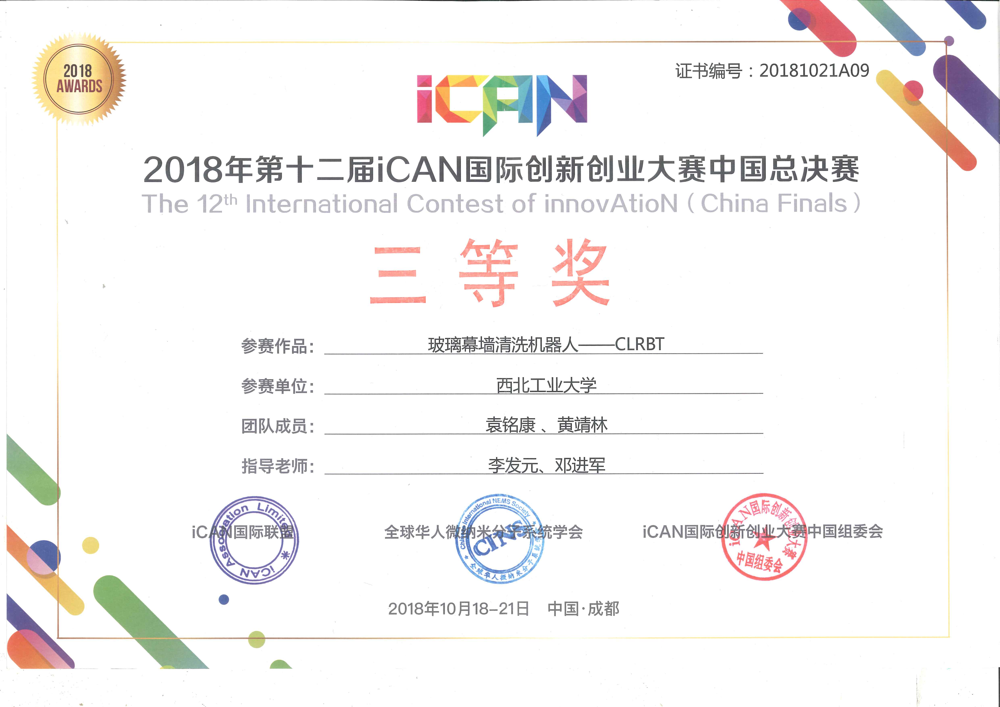
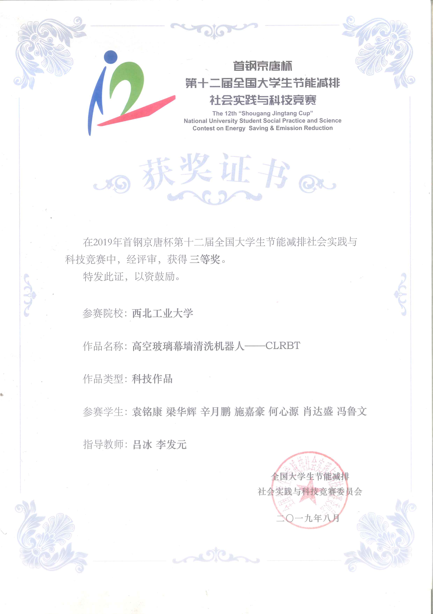
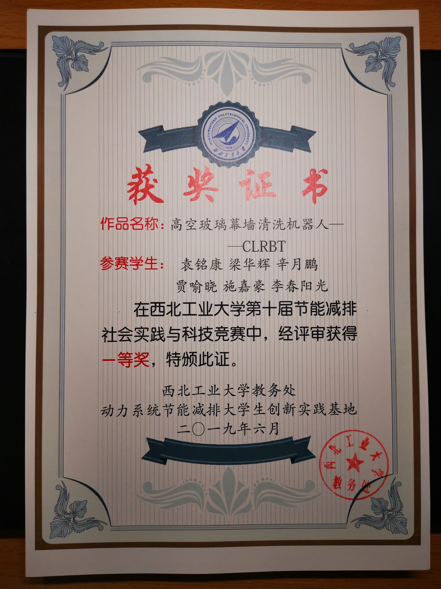
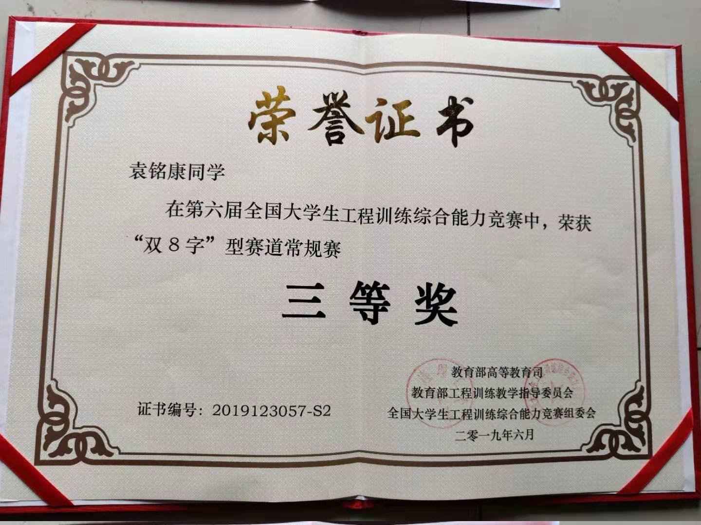
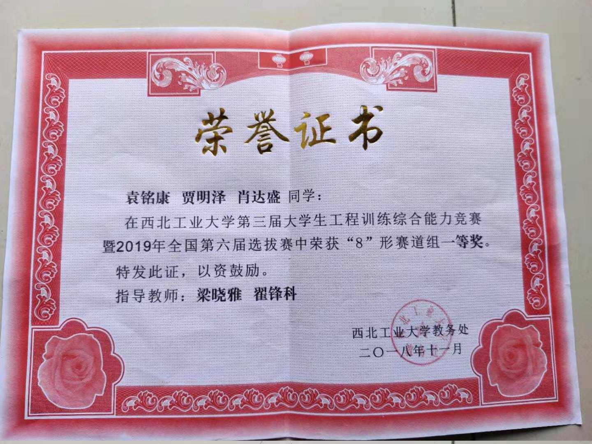

This is the utility model patent I applied for my wall-climbing cleaning robot, with my instructor as the first inventor and me as the second inventor!

## Awards
Third Prize in the 12th iCAN International Innovation and Entrepreneurship Competition China 2018

In the Shougang Jingtang Cup 12th National Energy Conservation and Emission Reduction Science and Technology Competition, won the third prize!

In the 10th National Energy Conservation and Emission Reduction Science and Technology Competition of Northwestern Polytechnical University, won the first prize!

Third Prize in the Sixth National Comprehensive Ability Competition for College Students in Engineering Training

First Prize in the Third Comprehensive Ability Competition of Engineering Training for Undergraduates of Northwestern Polytechnical University

The tilt-wing unmanned aerial platform project won the second prize of the 12th Xi'an High-tech ‘Challenge Cup’ Academic Science and Technology Works Competition!
