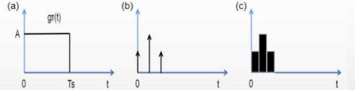

## 1.Project Overview
This project implements **Proximal Policy Optimization (PPO)** to train a drone for stable flight in the `gym-pybullet-drones` simulation environment. The agent learns to maximize cumulative rewards through policy iteration, leveraging PPO's stability and efficiency for continuous control tasks. Key components include:
- **Actor-Critic Architecture**: Separate networks for policy (Actor) and value estimation (Critic).
- **Clipped Surrogate Objective**: Ensures stable policy updates by limiting divergence.
- **Generalized Advantage Estimation (GAE)**: Balances bias-variance trade-off in advantage calculation.
- **Experience Buffer**: Efficiently stores and processes trajectory data for mini-batch updates.
## 2.PPO Algorithm Flow for UAV Simulation Control

### **Module 1: Data Collection**  
1. **Step 1:** Assign the current policy network parameters \(\theta\) as the old policy network parameters \(\theta_{old}\).  
2. **Step 2:** Input the initial state \(s_0\) into the old policy network. Since both states \(s\) and actions \(a\) are continuous, the policy network adopts a **stochastic Gaussian policy framework**. The network outputs the mean \(\mu_{old}\) and standard deviation \(\sigma_{old}\) of the Gaussian distribution for action \(a\), generating the policy function \(\pi_{old}(a|s, \theta_{old})\). An action \(a_0 \sim \pi_{old}(\cdot | s_0, \theta_{old})\) is sampled and executed in the environment. The environment returns a reward \(r_1\) and transitions to the next state \(s_1\), forming a transition tuple \((s_0, a_0, r_1, s_1)\). This loop repeats, generating multiple tuples \((s_0, a_0, r_1, s_1), (s_1, a_1, r_2, s_2), \ldots\), which are stored in an **experience replay buffer** for training.

---

### **Module 2: Compute State Value Function and Advantage Function**  
1. **Step 1:** Sequentially retrieve transition tuples from the replay buffer. Input each state \(s_t\) into the **value network** (Critic) to compute its estimated value:  
   \[
   V(s_t; w) \quad \text{(e.g., } q_0 = V(s_0; w), \, q_1 = V(s_1; w), \ldots\text{)}
   \]  
2. **Step 2:** Compute the **TD target** for each state \(s_t\):  
   \[
   y_t = r_{t+1} + \gamma V(s_{t+1}; w)
   \]  
3. **Step 3:** Calculate the **TD error**:  
   \[
   \delta_t = V(s_t; w) - y_t
   \]  
4. **Step 4:** Compute the **advantage function \(A_t\)** using **Generalized Advantage Estimation (GAE)**. GAE reduces variance in policy gradients by combining multiple \(k\)-step advantage estimates:  
   \[
   A_t^{(k)} = \sum_{i=0}^{k-1} (\gamma \lambda)^i \delta_{t+i}
   \]  
   where \(\lambda \in [0, 1]\) is a hyperparameter for balancing bias and variance. The final GAE is a weighted average:  
   \[
   A_t^{GAE(\gamma, \lambda)} = \sum_{n=0}^\infty (\gamma \lambda)^n \delta_{t+n}
   \]  

---

### **Module 3: Update the Value Network (Critic)**  
1. **Step 1:** Define the **Mean Squared Error (MSE)** loss for the value network:  
   \[
   L(w) = \left[ V(s_t; w) - \left( r_{t+1} + \gamma V(s_{t+1}; w) \right) \right]^2
   \]  
2. **Step 2:** Compute the gradient of the loss:  
   \[
   \nabla_w L(w) = 2 \delta_t \nabla_w V(s_t; w)
   \]  
3. **Step 3:** Update the value network parameters using gradient descent (or mini-batch optimization):  
   \[
   w \leftarrow w - 2\alpha \delta_t \nabla_w V(s_t; w)
   \]  

---

### **Module 4: Update the Policy Network (Actor)**  
1. **Step 1:** For each transition \((s_t, a_t, r_{t+1}, s_{t+1})\), compute the log-probability of action \(a_t\) under the **old policy** \(\pi_{old}\):  
   \[
   \log \pi_{old}(a_t | s_t, \theta_{old})
   \]  
2. **Step 2:** Train the current policy network:  
   - **(a)** Input \(s_t\) into the **new policy network** to compute the updated Gaussian parameters \(\mu_{new}\) and \(\sigma_{new}\). Calculate the log-probability under the new policy:  
     \[
     \log \pi_{new}(a_t | s_t, \theta_{new})
     \]  
   - **(b)** Compute the **importance sampling ratio**:  
     \[
     r(\theta) = \exp\left[ \log \pi_{new}(a_t | s_t, \theta_{new}) - \log \pi_{old}(a_t | s_t, \theta_{old}) \right]
     \]  
   - **(c)** Calculate the **clipped policy gradient** using the advantage \(A_t^{GAE}\):  
     \[
     \nabla_{\theta_{new}} J^{CLIP}(\theta_{new}) = \mathbb{E} \left[ \min\left( r(\theta) A_t^{GAE}, \, \text{clip}(r(\theta), 1-\epsilon, 1+\epsilon) A_t^{GAE} \right) \right]
     \]  
     where \(\epsilon\) is a clipping hyperparameter (e.g., \(\epsilon = 0.2\)).  
   - **(d)** Update the policy network:  
     \[
     \theta_{new} \leftarrow \theta_{old} + \beta \nabla_{\theta_{new}} J^{CLIP}(\theta_{new})
     \]  
3. **Step 3:** Set \(\theta_{old} \leftarrow \theta_{new}\) and repeat Modules 1–4 iteratively.  

## 3.Algorithm Implementation Highlights

### 3.1 Core Components
- **Dual Optimizers**:  
  Actor and Critic networks use separate Adam optimizers with distinct learning rates to decouple updates:
  ```python
  self.actor_opt = Adam(actor.parameters(), lr=3e-4)
  self.critic_opt = Adam(critic.parameters(), lr=1e-3)
  ```
- **Policy Loss with Clipping**:  
  Limits policy updates to prevent drastic changes:
  $$
  L^{CLIP} = \mathbb{E}_t\left[\min\left(r_t(\theta)A_t, \text{clip}(r_t(\theta), 1-\epsilon, 1+\epsilon)A_t\right)\right]
  $$
- **Entropy Regularization**:  
  Encourages exploration by penalizing low-entropy policies.

### 3.2 Critical Design Choices
- **Parameter Isolation**: Ensures gradients from Actor and Critic do not interfere.
- **KL Early Stopping**: Halts policy updates if KL divergence exceeds `1.5 * target_kl`.
- **Normalization**:  
  - **Observation Normalization**: Standardizes states using running mean/std.  
  - **Reward Normalization**: Scales rewards based on discounted return statistics.

## Disturbance Injection Framework for Quadcopter Control in Gym-PyBullet-Drones Environment  

### 1. Project Overview
This project implements a modular disturbance injection framework within the **gym-pybullet-drones** simulation environment to evaluate and enhance the robustness of quadcopter control algorithms. The framework supports dynamic perturbation of system inputs (e.g., motor RPMs) and states (e.g., position, velocity), enabling rigorous testing of control policies under realistic disturbances such as wind gusts, sensor noise, and electromagnetic interference.  

Key contributions include:    
- **Composable disturbance sequences** (e.g., multi-step pulses, decaying oscillations).  
- **Reproducible experiments** via deterministic random seed management.  

### 2. Technical Implementation  

The codebase employs a **Composite Pattern**  to unify individual disturbances into complex sequences:  

```python  
class Disturbance:  
    def apply(self, target, env):  # Base class for all disturbances  
        return target  

class DisturbanceList(Disturbance):  # Composite class  
    def apply(self, target, env):  
        for disturb in self.disturbances:  # Sequentially apply perturbations  
            target = disturb.apply(target, env)  
        return target  
```
  
- **Flexibility**: Combine impulse, noise, and periodic disturbances.  
- **Reusability**: Disturbances can be masked to specific state/input dimensions (e.g., apply wind only to x-axis) using `mask` parameters 

#### Impulse Disturbance Design
The `ImpulseDisturbance` class models short-duration perturbations with configurable waveforms:  
```python  
class ImpulseDisturbance(Disturbance):  
    def __init__(self, magnitude=1, duration=1, decay_rate=1):  
        # Waveform examples: square (decay_rate=1), triangle (decay_rate<1)  
        self.magnitude = magnitude  
        self.decay = decay_rate ** np.arange(duration)  
```
  
- **Waveform types**: Square, triangular, and exponential decay pulses 

- **Mathematical representation**:  
  - **Square pulse**: $ \delta(t) = A \cdot \mathbb{I}_{[t_0, t_0 + \Delta t]}(t) $  
  - **Triangular pulse**: $ \delta(t) = A \cdot (1 - \frac{t}{\Delta t}) $  

#### Deterministic Randomness
The `seed()` method ensures reproducibility by synchronizing disturbance randomization with the simulation:  
```python  
def seed(self, env):  
    self.np_random = env.np_random   
```
This is critical for RL policy evaluation under stochastic disturbances.  
  

