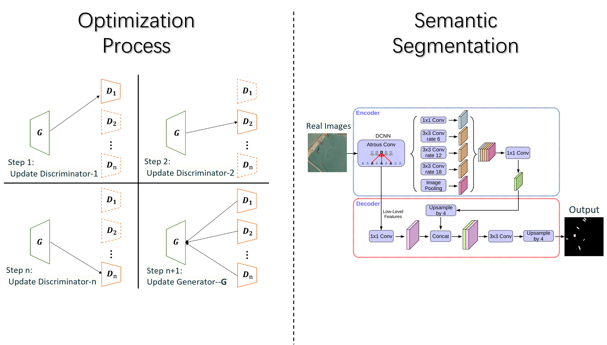
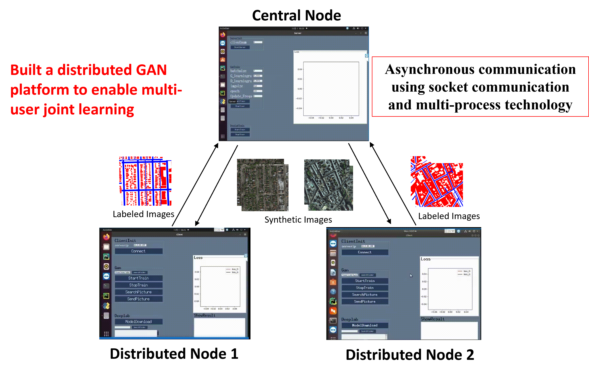

Based on the open-source gym-pybullet-drones simulation environment, I developed a UAV simulation scenario that utilizes an MPC controller for trajectory tracking, supporting constraint definition and disturbances. I used the cf2 UAV model provided by gym-pybullet-drones, and I created UAV formation trajectories in Blender using the Skybrush plugin to facilitate algorithm verification. Ultimately, this resulted in a simulation effect of multiple UAVs tracking trajectories. 

## MPC

<!-- $$ L(x, u, X_r, U_r, Q, R) = \sum_{k=0}^{N-1} \left( \|x_k - X_r\|_Q^2 + \|u_k - U_r\|_R^2 \right) $$ -->

After finishing the training of the Distributed GAN, we collected the synthetic images from the Distributed GAN as the training set for different tasks. we use the trained Generator as a data provider to train DeepLab v3+ model for a semantic segmentation task on remote sensing images.

## Blender Skybrush

Based on the Distributed GAN, we establish an experimental platform, and visualize the training and testing process. A schematic diagram of the DGAN experimental platform is shown.
In our experiments, we deploy DGAN on three independent hosts for the distributed learning, and socket and multi process technology are used to realize asynchronous communication between the server and multiple clients. 

## Experiments

Three different remote sensing datasets are used: City-OSM, WHU building dataset, and Kaggle Ship.The above figure shows that the image synthesis results are similar to traditional GAN.Distributed GAN networks can learn the data distribution of remote sensing images well.

