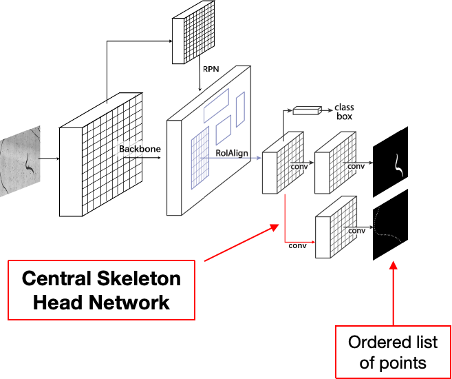
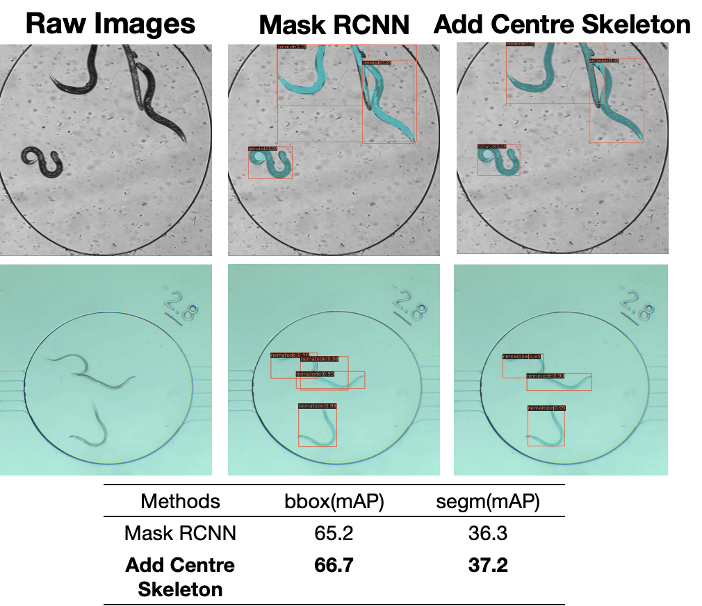
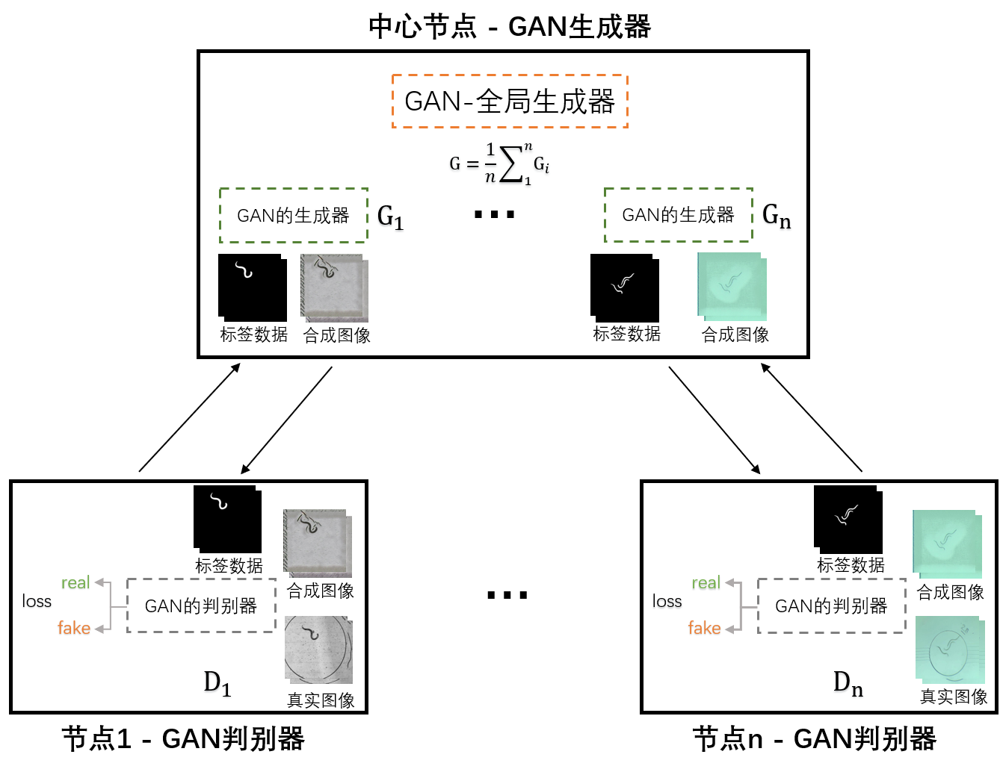
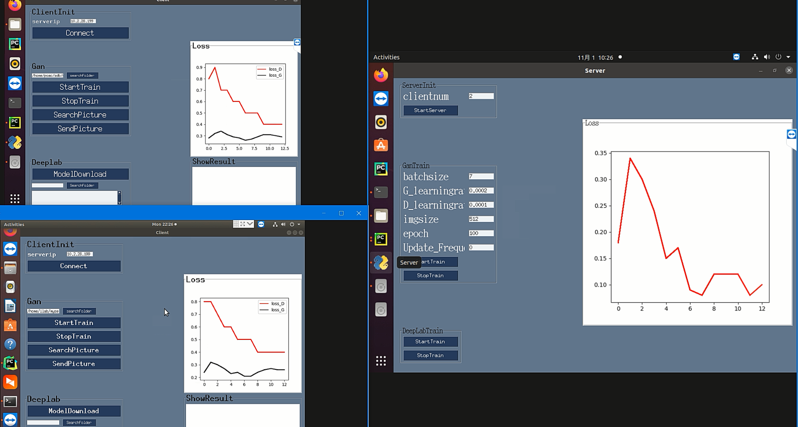
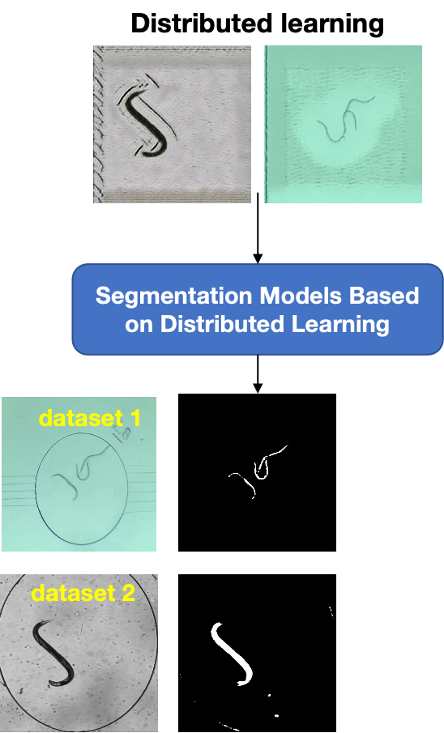

Aiming at the problem that the instance segmentation accuracy of nematode images still needs to be improved, the instance segmentation model with the addition of a centroskeleton head network is proposed to strengthen the model. 
In this project, I am mainly responsible for extracting the centroskeleton information of nematode images and designing the centroskeleton head network, and adding the centroskeleton head network based on the Mask RCNN network. I used Pytorch and Mmdetection framework to complete this project. The final result shows that the segmentation accuracy of nematode image instances is improved by about 1%.

## Problems

Using traditional deep learning networks, instance segmentation of nematodes, especially images with multiple nematodes overlapping, the segmentation accuracy of traditional instance segmentation networks works poorly and the target segmentation error rate is high!

## Solution

Adding a centroskeletal head network to the example segmentation model to enhance model representation:
1. Centroskeleton head network enhances model representation of nematode elongation features
2. The centroskeleton is represented as an ordered column of points.

## Experiments

Incorporation of a central skeleton head network improves nematode image instance segmentation accuracy by about 1% and reduces overlapping nematode misdetection

## Distributed Learning

In addition to improving the accuracy of nematode instance segmentation, I also applied the nematode dataset to another project on distributed GAN networks to test the effectiveness of the performance of distributed GAN networks in the nematode dataset.

Below is a schematic of the distributed GAN platform I developed with the nematode dataset, the two on the left are the CLIENT clients and the right is the server.

I used the generated nematode dummy image in the example segmentation network model and the results are shown below:

