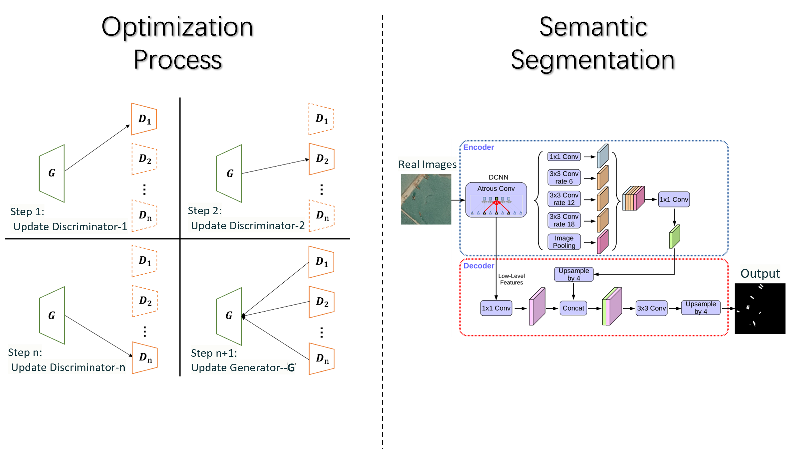
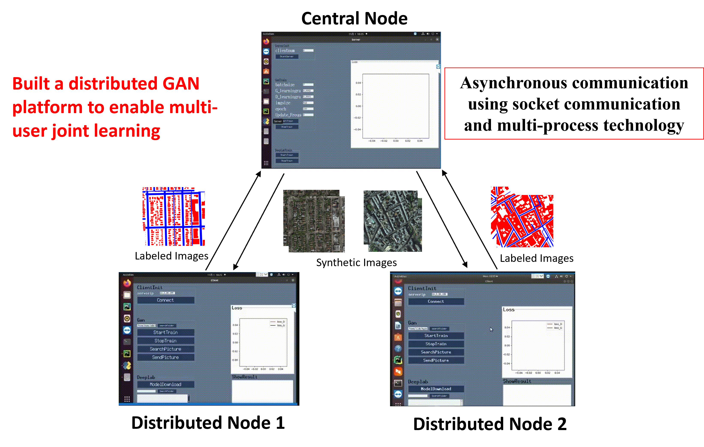

The DGAN is composed of multiple distributed discriminators and a central generator. The central generator, denoted as G, takes the labeled images as input and generates synthetic images to fool the discriminators. The local discriminators, denote as D1 to Dn, distinguish between real and fake images. In the framework, only the synthetic images, losses, and labeled images are exchanged between the central generator and local discriminators. In this way, the original images of local discriminators and model information are not shared, and therefore the privacy of the original images is protected. 

##Steps

After finishing the training of the Distributed GAN, we collected the synthetic images from the Distributed GAN as the training set for different tasks. we use the trained Generator as a data provider to train DeepLab v3+ model for a semantic segmentation task on remote sensing images.

##Platforms

Based on the Distributed GAN, we establish an experimental platform, and visualize the training and testing process. A schematic diagram of the DGAN experimental platform is shown.
In our experiments, we deploy DGAN on three independent hosts for the distributed learning, and socket and multi process technology are used to realize asynchronous communication between the server and multiple clients. 

##Experiments

Three different remote sensing datasets are used: City-OSM, WHU building dataset, and Kaggle Ship.The above figure shows that the image synthesis results are similar to traditional GAN.Distributed GAN networks can learn the data distribution of remote sensing images well.

##Reconsider the data distribution

In the above experiments, remote sensing images of different cities are mixed. However, the reality is that different client nodes may have remote sensing images of different cities/regions. To get closer to reality, we divide the images according to different cities in this section.

By adjusting the model update strategy, the results of synthetic images are comparable to distributed GAN using a mixture of remote sensing image data distributions

##Improvements and Applications

Aiming at the problem of different data distribution of each distributed node, which leads to the application performance of the model generated by the existing method to be improved.
Improve the central node from a single model to a fusion of multiple sub-models to improve the convergence effect of joint learning, and then improve the application performance of the generated model.

The results show that the above central node improvement improves the performance of the model on the image segmentation task

##Instance Segmentation Method Improvement

Multiple nematode overlapping images can seriously affect the segmentation accuracy of traditional instance segmentation networks. Therefore, we add the central skeleton head network into the instance segmentation model to strengthen the model expression ability.

Incorporation of a central skeleton head network improves nematode image instance segmentation accuracy by about 1% and reduces overlapping nematode misdetection

