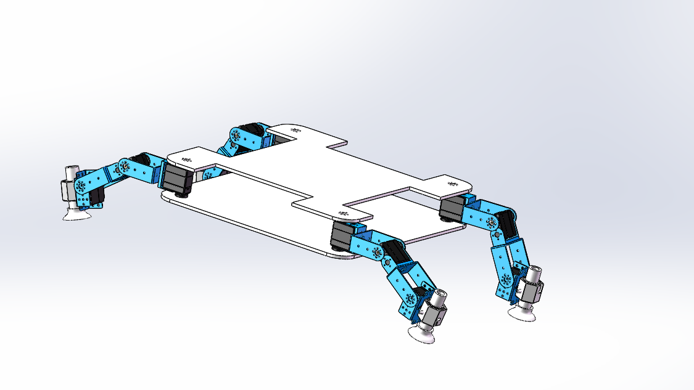

I used the principle of negative vacuum pressure to create four legs with suction cups and used microcontroller control to allow the robot to attach itself to the wall and move!

## Presentations

I installed a vacuum pump on the back of the robot, which provides enough suction to hold the robot firmly to the wall without any external equipment, through its own power supply. Programming the robot with a microcontroller allows it to perform a variety of actions, and the four legs are long enough to allow him to cross even small obstacles.

I also, on the software, made a model of the robot for printing 3D models and cutting acrylic sheets.

