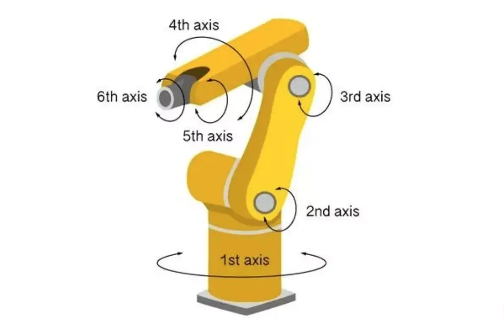

I built a simple six-degree-of-freedom mechanical claw using multiple servos, and with a fixed programme, was interested in grabbing something!

## Six-axis

A six-axis robot can move through the x, y, and z axes, while each axis can be rotated independently, again with one more axis free to rotate than a five-axis robot. The first joint of a 6-axis robot can rotate freely in the horizontal plane like a 4-axis robot, and the last two joints can move in the vertical plane. In addition, six-axis robots have one ‘arm’ and two ‘wrist’ joints, which give them similar capabilities to human arms and wrists. This means that they can pick up parts orientated in any direction on the horizontal plane and place them into packaged products at a particular angle.

