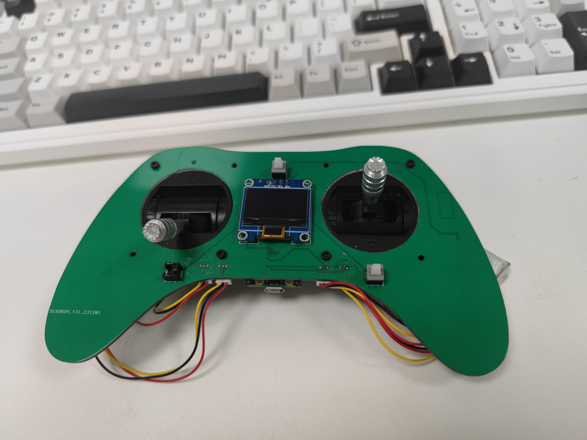

<!-- Google tag (gtag.js) -->
<script async src="https://www.googletagmanager.com/gtag/js?id=G-G6S1SQP4ZW"></script>
<script>
  window.dataLayer = window.dataLayer || [];
  function gtag(){dataLayer.push(arguments);}
  gtag('js', new Date());

  gtag('config', 'G-G6S1SQP4ZW');
</script>

#### **Project Overview**  
This project implements a palm-sized autonomous drone using an **ESP32 microcontroller** for real-time flight stabilization. Key innovations include:  
- **Cascade PID Control**: Dual-loop angular rate & attitude stabilization.  
- **WiFi Commanding**: Low-latency UDP protocol (15Hz update) for remote control.  
- **Safety Features**: Signal loss protection, low-voltage cutoff, and failsafe landing.  
- **Custom Transmitter**: Dedicated controller with OLED telemetry display.  

---

#### **Software Implementation**  

1. **Sensor Fusion & Filtering**  
   ```cpp
   // IMU Data Acquisition (MPU6050)
   Wire.beginTransmission(IMUAddress);
   Wire.write(0x3B); // Start reading from ACCEL_XOUT_H
   Wire.endTransmission();
   Wire.requestFrom(IMUAddress, 14);
   acc_axis[1] = Wire.read() << 8 | Wire.read(); // X-axis
   acc_axis[2] = Wire.read() << 8 | Wire.read(); // Y-axis
   acc_axis[3] = Wire.read() << 8 | Wire.read(); // Z-axis
   ```

   - **Accelerometer Calibration**: Dynamic zero-offset compensation  
   - **Gyro Integration**: Complementary filter for attitude estimation  

2. **Cascade PID Control**  
   ```cpp
   /* Roll Axis Control (Inner: Angular Rate / Outer: Angle) */
   // Outer PID (Angle error → Rate setpoint)
   float angle_err_roll = pid_roll_setpoint - angle_roll;
   outside_pid_integral_roll += outside_pid_Ki_roll * angle_err_roll;
   float rate_setpoint_roll = outside_pid_Kp_roll * angle_err_roll 
                            + outside_pid_integral_roll 
                            + outside_pid_Kd_roll * (angle_err_roll - last_outside_pid_angle_err_roll);
   
   // Inner PID (Rate tracking)
   float rate_err_roll = rate_setpoint_roll - gyro_roll_input;
   inside_pid_integral_roll += inside_pid_Ki_roll * rate_err_roll;
   pid_output_roll = inside_pid_Kp_roll * rate_err_roll 
                   + inside_pid_integral_roll 
                   + inside_pid_Kd_roll * (rate_err_roll - last_inside_pid_angular_err_roll);
   ```

   - **Tuned Parameters**:  
- Roll/Pitch: `Kp=0.7 (outer), 0.5 (inner); Ki=0.045 (outer)`  
- Yaw: `Kp=3.1, Kd=0.3`  
   - **Output Clamping**: ±300μs PWM limit for motor mixing  

3. **Motor Mixing Logic**  
   ```cpp
   // Quadcopter X-configuration Mixing
   esc_1 = throttle - pid_output_pitch + pid_output_roll - pid_output_yaw; // Front-R
   esc_2 = throttle + pid_output_pitch + pid_output_roll + pid_output_yaw; // Rear-R
   esc_3 = throttle + pid_output_pitch - pid_output_roll - pid_output_yaw; // Rear-L
   esc_4 = throttle - pid_output_pitch - pid_output_roll + pid_output_yaw; // Front-L
   ```

   - **PWM Generation**: 1-2ms pulse width mapped to 0-100% throttle  

4. **Safety Mechanisms**  
   - **Signal Loss Detection**: 500ms timeout triggers motor cutoff  
     ```cpp
     if (millis() - lastPacketTime > timeoutInterval) {
       digitalWrite(Red_LED, HIGH);
       esc_1 = esc_2 = esc_3 = esc_4 = 1000; // Stop motors
     }
     ```

   - **Low Voltage Protection**:  
     ```cpp
     battery_voltage = (analogRead(bat_pin)/4096.0)*3.3*(1.0 + 1.0) + diode_vol_drop;
     if(battery_voltage < 3.5){ low_battery = true; }
     ```


---

#### **System Workflow**  
1. **Startup Sequence**:  
   - IMU calibration (2000-sample averaging)  
   - WiFi AP initialization (`PicoW:password`)  
   - UDP listener binding (port 8888)  

2. **Real-Time Control Loop**:  
   - **4ms Timing**: Hardware timer interrupt-driven cycle  
   - **Data Flow**:  
     ```
     Sensor Read → Attitude Estimate → PID Compute → Motor Update
                     ↑                    ↑
               UDP Packet Parsing   Battery Check
     ```


---

#### **Video Content**  
