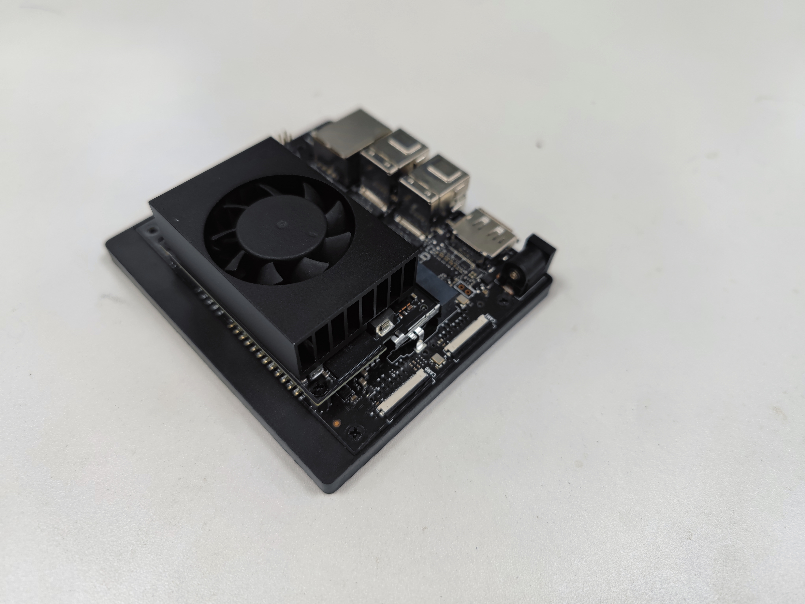
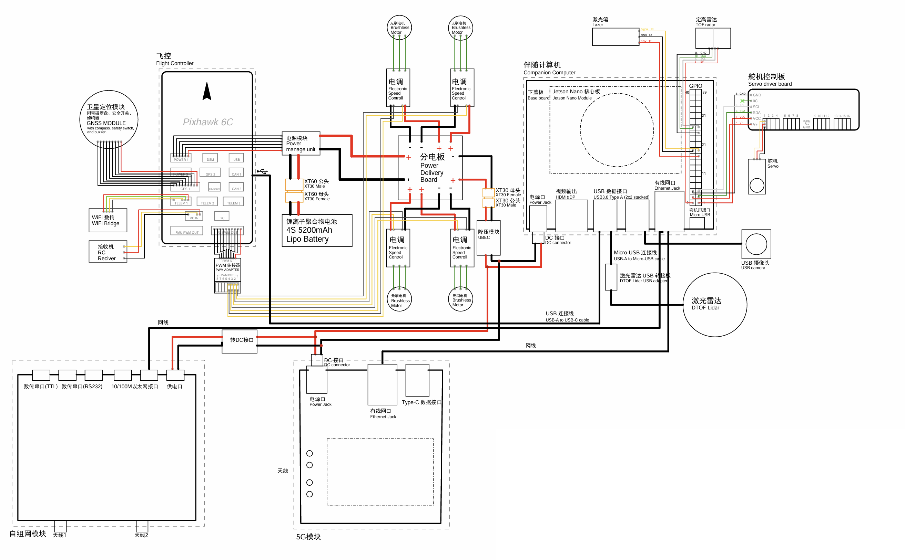

<!-- Google tag (gtag.js) -->
<script async src="https://www.googletagmanager.com/gtag/js?id=G-G6S1SQP4ZW"></script>
<script>
  window.dataLayer = window.dataLayer || [];
  function gtag(){dataLayer.push(arguments);}
  gtag('js', new Date());

  gtag('config', 'G-G6S1SQP4ZW');
</script>

### **Project Overview**  
This project integrates **Fast LIO LiDAR SLAM** and **EGO-Planner path planning** algorithms to develop a real-time obstacle avoidance system for UAVs using an NVIDIA Jetson Orin NX 16G embedded platform. The UAV employs a Livox LiDAR for environmental perception and transmits navigation commands to the PX4 flight controller via MAVROS. The system achieves dynamic obstacle avoidance in complex environments while optimizing resource usage on embedded hardware.

---

### **Hardware Architecture**  
1. **Computing Core: NVIDIA Jetson Orin NX 16G**  
   - **Key Roles**:  
- Runs Fast LIO (real-time point cloud processing) and EGO-Planner (trajectory optimization).  
- Manages ROS nodes for sensor fusion and communication.  
   - **Interfaces**:  
- Ethernet connection to LiDAR.  
- USB serial port (`/dev/ttyACM0`) for PX4 communication at 921600 baud rate.  

2. **Perception Unit: Livox LiDAR**  
   - **Data Pipeline**:  
- Publishes point clouds at 15 Hz (configured in `px4_lidar.launch`).  
- Top-mounted installation for optimal field-of-view coverage.  

3. **Control Unit: PX4 Flight Controller**  
   - **Communication Protocol**:  
- MAVROS bridges ROS topics (e.g., `/mavros/setpoint_position/local`) to MAVLink commands.  
**Electrical Diagram**:

---

### **Software Architecture & Algorithm Integration**  
![Software Architecture Diagram (insert your system diagram here)]

1. **Environment Perception: Fast LIO**  
   - **Configuration Highlights (`mapping_mid360.launch`)**:  
     ```xml
     <!-- Key parameters for SLAM optimization -->
     <param name="point_filter_num" value="3" />   <!-- Point cloud downsampling ratio -->
     <param name="filter_size_map" value="0.2" />   <!-- Local map resolution (meters) -->
     <param name="max_iteration" value="3" />       <!-- Kalman filter iterations -->
     ```

   - **TF Frames**:  
- Static transforms between `world`, `map`, `odom`, and `camera_init` frames.  
- IMU-to-body frame calibration via `tf_base_to_imu` node.  

2. **Path Planning: EGO-Planner**  
   - **Dynamic Configuration (`single_run_in_exp.launch`)**:  
     ```xml
     <arg name="map_size_x" value="25" />      <!-- Planning area X-axis (meters) -->
     <arg name="map_size_y" value="25" />      <!-- Y-axis -->
     <arg name="max_vel" value="0.4" />        <!-- Max flight speed (m/s) -->
     <arg name="max_acc" value="1.5" />        <!-- Max acceleration (m/s²) -->
     <arg name="obj_num" value="10" />         <!-- Max dynamic obstacles tracked -->
     ```

   - **Workflow**:  
- Subscribes to `/mavros/local_position/odom` for real-time UAV localization.  
- Generates collision-free B-spline trajectories using gradient-based optimization.  

3. **System Initialization Workflow**  
   - **PX4 & LiDAR Startup (`px4_lidar.launch`)**:  
     ```xml
     <!-- PX4 connection -->
     <arg name="fcu_url" value="/dev/ttyACM0:921600" />
     <!-- LiDAR driver configuration -->
     <arg name="publish_freq" value="15.0" />  <!-- Point cloud frequency -->
     ```

   - **Visualization Tools**:  
     ```bash
     rviz -d default.rviz  <!-- Displays point clouds, UAV pose, and planned paths -->
     ```


---

#### **Static Obstacle Avoidance**  
UAV navigating through the pillar

UAV navigating through the circle


