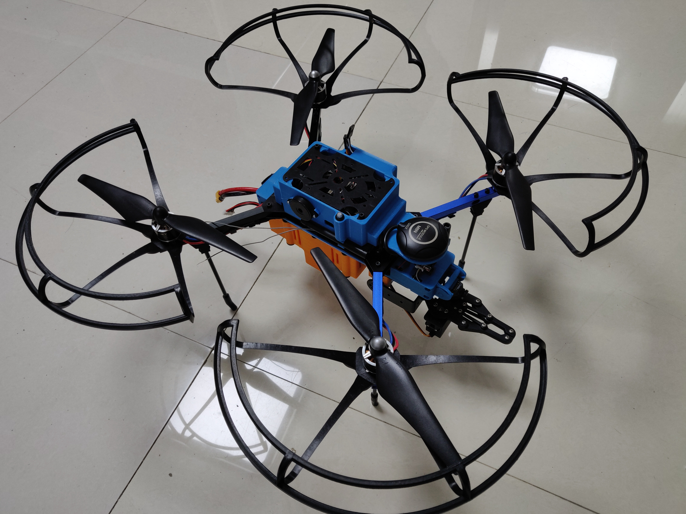
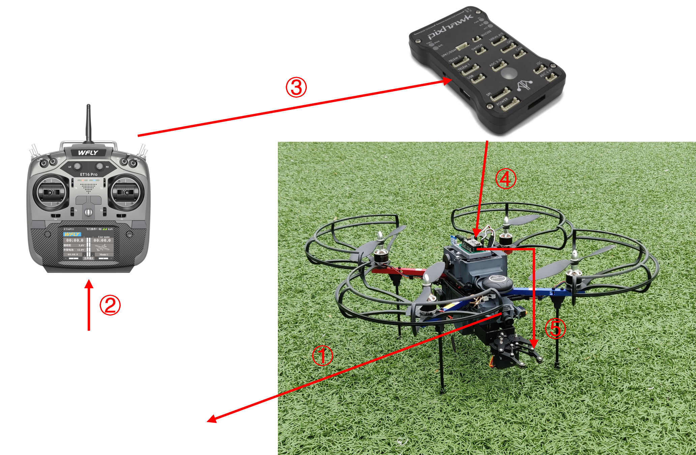
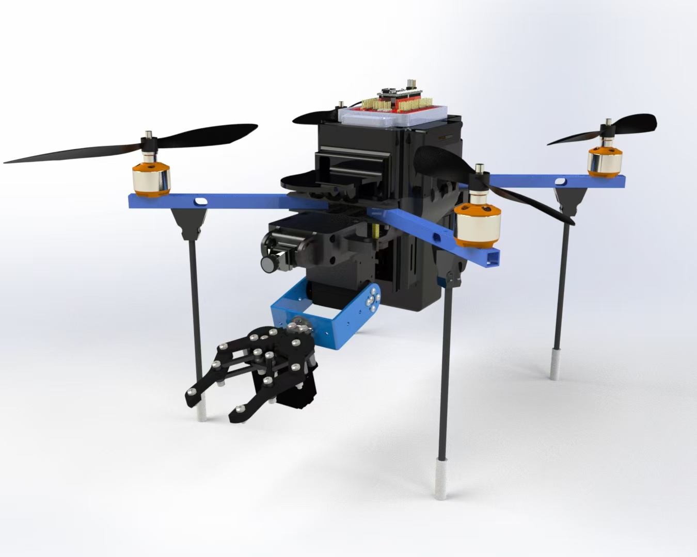
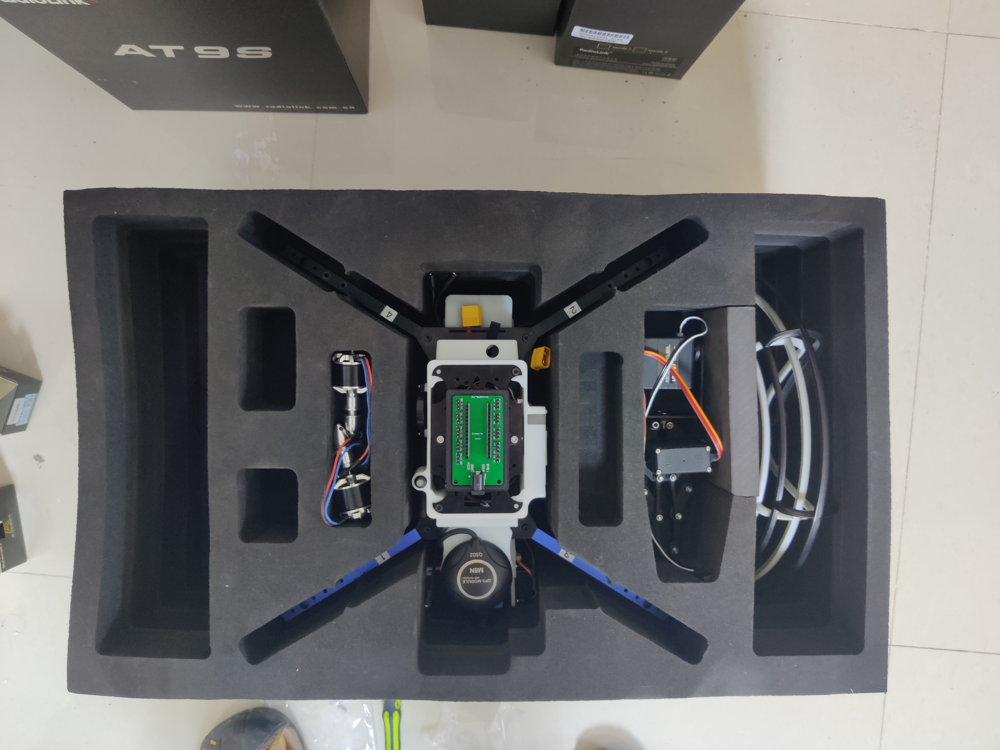
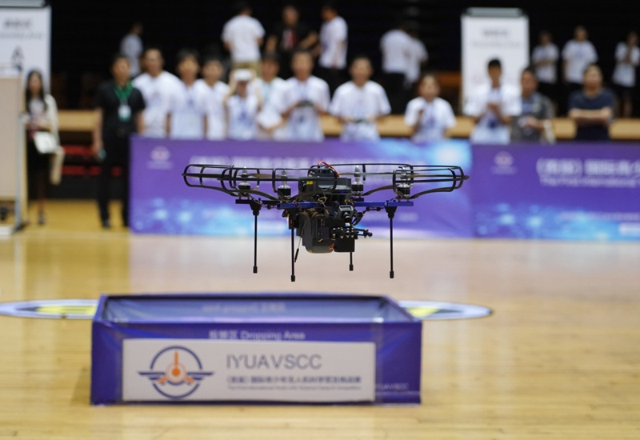

<!-- Google tag (gtag.js) -->

I designed and assembled my own drone and used it as the designated drone for a youth competition to get more students to learn about and love drones.

## Descriptions

The drone uses pixhawk as the flight control and includes various peripherals such as optical flow, digital transmission, mapping, GPS, camera and so on. The operator can use FPV glasses for first view control of the drone. The bottom of the drone is mounted with a mechanical claw, which is controlled by a companion microcontroller on the top of the drone, and can be used with a remote control to make the appropriate movements to pinch items.

## Design

Here I show some 3D models and exploded views of the drone. The main part of the drone consists mainly of 3D printed parts.

## Competition

Showing pictures of drones in competition

