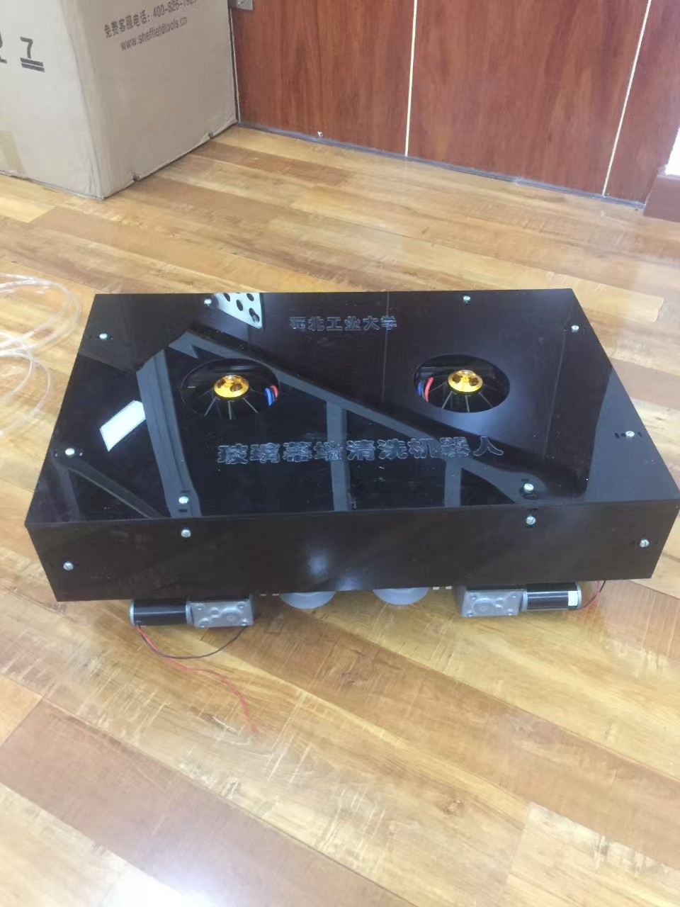

<!-- Google tag (gtag.js) -->

I built a brand new wall-climbing robot that moves on wheels and has an aluminium build. It uses both vacuum negative pressure and a culvert fan to achieve adsorption to the wall.

## Vacuum Negative Pressure

Negative vacuum pressure is the robot's main method of adsorption on walls or glass, and this system consists of eight suction cups, two vacuum generators and an air pump on the floor. The air pump supplies air to the two vacuum generators, each of which is responsible for providing suction to the four suction cups, which can attach the robot to the wall very firmly. Even when I pull the robot with full force, it still won't fall off.

## Culvert Fans

To be even safer, I also added culvert fans to the robot to provide extra thrust. Normally they don't work, it's only when the robot needs to pass through a gap in the wall (such as a brick seam or glass joint) that they start working to generate enough thrust to press the robot against the wall. This is mainly due to the fact that when passing through gaps in the wall, the suction cups do not stay closed and are not able to generate enough suction. Therefore the addition of culvert fans can improve the safety of the robot working is.

## Presentations

For aesthetics, I added shells to the robots to hide the internals！

This is a panoramic photo of the robot at work, including the air pump. I added cleaning fluid and a glass scraper to the robot as well to allow it to do the job of cleaning the glass. Also, I modified the exterior to make it look better!