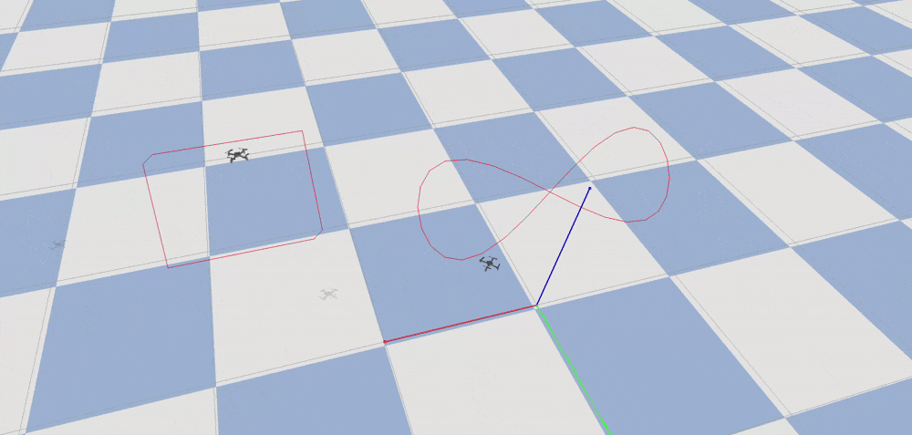

Based on the open-source gym-pybullet-drones simulation environment, I developed a UAV simulation scenario that utilizes an MPC controller for trajectory tracking, supporting constraint definition and disturbances. I used the cf2 UAV model provided by gym-pybullet-drones, and I created UAV formation trajectories in Blender using the Skybrush plugin to facilitate algorithm verification. Ultimately, this resulted in a simulation effect of multiple UAVs tracking trajectories. 

## Model Predictive Control (MPC) for Drone Swarm Path Tracking

This project demonstrates the design and implementation of a high-performance Model Predictive Control (MPC) system for precise trajectory tracking in multi-drone swarms. The algorithm leverages symbolic computation, nonlinear optimization, and dynamic constraints to achieve robust path following in complex 3D environments.  
**Visual Display**:  

### **Key Algorithmic Components**  
1. **MPC Framework**  
   - **Prediction Horizon**: Time-varying optimization over a receding horizon of $T$ steps.  
   - **State-Space Model**: 12-dimensional dynamics (position, velocity, Euler angles, angular rates).  
   - **Cost Function**: Quadratic penalty on state/input deviations and soft constraint violations.  
   - **Real-Time Adaptation**: Warm-starting initial guesses from prior solutions for faster convergence.  

2. **Core Implementation**  
   - **Symbolic Dynamics**:  
     ```python  
     # CasADi-based continuous-time dynamics for quadrotors  
     x_dot = Rob @ [0, 0, Σf_i] / m - [0, 0, g]  
     rate_dot = J⁻¹(Mb - skew(ω) @ Jω)  
     ```  
     - Derived rigid-body equations for 3D motion, including thrust allocation and gyroscopic effects.  
   - **Optimization Formulation**:  
     - **Variables**: State \( x \in \mathbb{R}^{12} \), input \( u \in \mathbb{R}^4 \) (rotor thrusts).  
     - **Constraints**:  
       - *Hard*: Actuator limits, collision avoidance.  
       - *Soft*: Slack variables with quadratic penalties for dynamic obstacle tolerance.  
     - **Cost Terms**:  
       $$J = \sum_{i=0}^{T-1} \|x_i - x_{ref}\|_Q^2 + \|u_i\|_R^2 + \|x_T - x_{goal}\|_P^2$$  
   - **Solver Configuration**:  
     - **IPOPT** for nonlinear optimization with sparse derivative computations.  
     - **CasADi** for automatic differentiation and symbolic Jacobian/Hessian generation.  

3. **Technical Highlights**  
   - **Warm-Start Initialization**:  
     ```python  
     x_guess, u_guess = self.compute_initial_guess(obs)  # Reuse prior solutions  
     opti.set_initial(x_var, x_prev)  # Accelerate IPOPT convergence  
     ```  
   - **Trajectory Tracking**:  
     - Dynamic reference slicing from precomputed CSV paths.  
     - Horizon-aware trajectory extension with terminal state replication.  
   - **Robustness Features**:  
     - LQR gain compensation for disturbance rejection.  
     - Collision-checked path smoothing in Blender Skybrush.  

---

### **System Architecture**  
1. **Dynamics Linearization**  
   - Symbolic Jacobians for state/input derivatives:  
     \[ \frac{\partial f}{\partial x}, \frac{\partial f}{\partial u} \]  
   - Linearized discrete-time model for real-time updates:  
     \[ x_{k+1} = A x_k + B u_k \]  

2. **Constraint Handling**  
   - **State/Input Bounds**:  
     ```python  
     opti.subject_to(u_min <= u_var <= u_max)  # Actuator limits  
     opti.subject_to(sc(x_var) <= slack + tol)  # Soft safety margins  
     ```  
   - **Terminal Set**:  
     \[ x_T \in \mathcal{X}_{terminal} \]  

3. **Code Structure**  
   - **SymbolicModel Class**: Encapsulates dynamics, costs, and linearization.  
   - **MPC Solver**:  
     - `setup_optimizer()`: Configures IPOPT with problem-specific parameters.  
     - `solve()`: Executes optimization and extracts \( u^* \).  
   - **Data Pipeline**:  
     - CSV trajectory parsing → State reference generation → MPC-compatible format.  


## Drone Swarm Choreography with Blender Skybrush
**Visual Display**:  

This project showcases professional drone light show creation using Blender Skybrush's specialized toolkit:  

**Workflow Implementation**:  
1. **Formation Design**:  
   - Built intricate 3D swarm patterns through Skybrush's node-based animation system  
   - Programmed synchronized maneuvers using keyframe-free procedural animation  

2. **Drone Path Baking**:  
   - Automated CSV trajectory exports for 30+ drones  
   - Maintained flight safety through built-in collision detection algorithms  

3. **Show Visualization**:  
   - Rendered photorealistic previsualizations with Blender's Eevee engine  
   - Generated real-time swarm previews with accurate LED color sequencing  

**Technical Showcase**:  
- Timestamped CSV outputs for position (XYZ)   
- Automated path smoothing for fluid drone movements  
- Batch processing of 2000+ trajectory waypoints  


## Enhanced Trajectory Preprocessing for MPC-Compatible Path Generation  

**Visual Display**: 


*Cubic Spline Interpolation & Dynamic Curvature Constraints Implementation*

This trajectory refinement system bridges Blender Skybrush's raw outputs with MPC requirements through advanced signal processing:

**1. CSV Data Pipeline**  
```python
for i, file_name in enumerate(file_list):
    # Data normalization with scale factor consistency
    raw_waypoints = df[["x [m]", "y [m]", "z [m]"]].iloc[1:].values / 6.0  # Maintain scaling factor
    time_raw = df["Time [msec]"].iloc[1:].values / 1000.0  # Convert to seconds
```

**2. Temporal Domain Processing**  
- **Time Axis Reconstruction**:  
  ```python
  time_dense = np.linspace(start_time, end_time, 
                         int(control_freq_hz * duration_sec))  # Match MPC control frequency
  ```  
- **Phase Alignment**: Ensures temporal consistency across swarm agents through shared `duration_sec`

**3. Spatial Interpolation**  
*Cubic Spline Implementation*:  
```python
cs_x = CubicSpline(time_raw, raw_waypoints[:, 0], bc_type='natural')  # Natural boundary conditions
dense_waypoints = np.column_stack((cs_x(time_dense), cs_y(time_dense), cs_z(time_dense)))
```  
- **Continuity Enforcement**: \( C^2 \)-continuous trajectories prevent MPC discontinuity penalties  
- **Derivative Matching**: Implicitly satisfies \( \dot{x}_{ref} \) continuity for smooth MPC tracking

**4. Dynamic Feasibility Enforcement**  
*Adaptive Curvature Constraints*:  
```python
velocity = np.gradient(dense_waypoints, axis=0) * control_freq_hz  # First derivative
acceleration = np.gradient(velocity, axis=0) * control_freq_hz  # Second derivative
acc_magnitude = np.linalg.norm(acceleration, axis=1)

# Physically-aware smoothing
max_acc = 2 * 9.81  # 2g threshold matching drone dynamics
dense_waypoints[idx] = 0.5*(dense_waypoints[idx-1] + dense_waypoints[idx+1])  # Local averaging
```  
- **Kinematic Feasibility**: Maintains \( \|a\| \leq 2g \) for quadrotor dynamics compatibility  
- **Stability Preservation**: Selective smoothing avoids over-damping critical waypoints

**5. MPC Integration**  
```python
TARGET_POS.append(dense_waypoints)  # Feed to MPC reference generator
```  
- **State Vector Alignment**: Processed waypoints directly populate \( x_{ref} \in \mathbb{R}^{12} \)  
- **Temporal Synchronization**: \( \Delta t = 1/\text{control\_freq\_hz} \) matches MPC discretization

